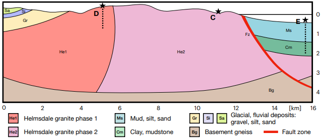
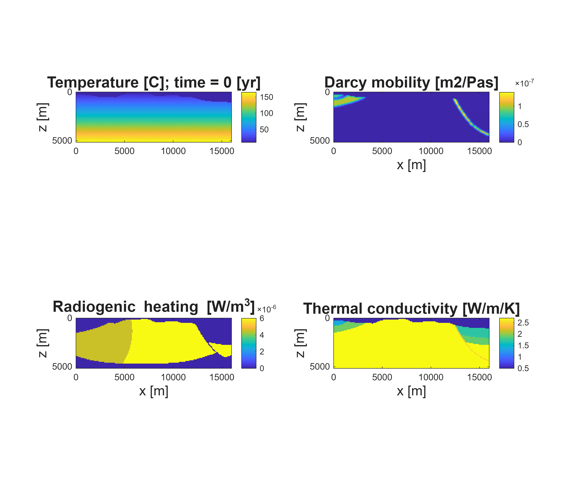
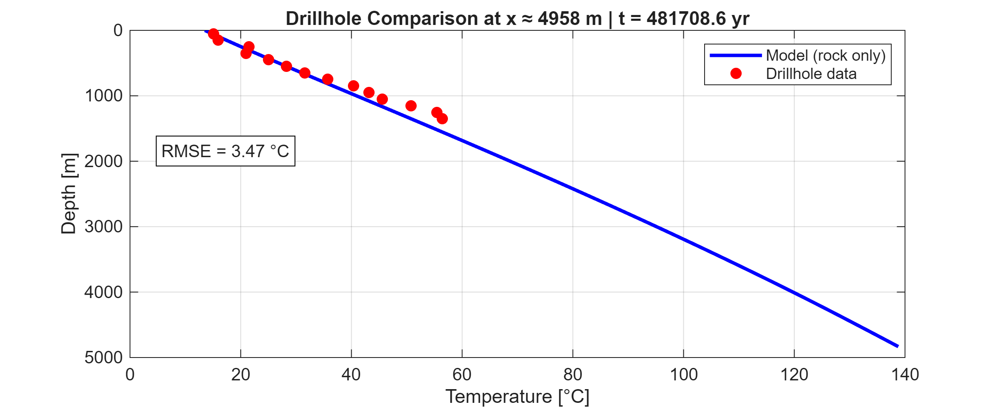
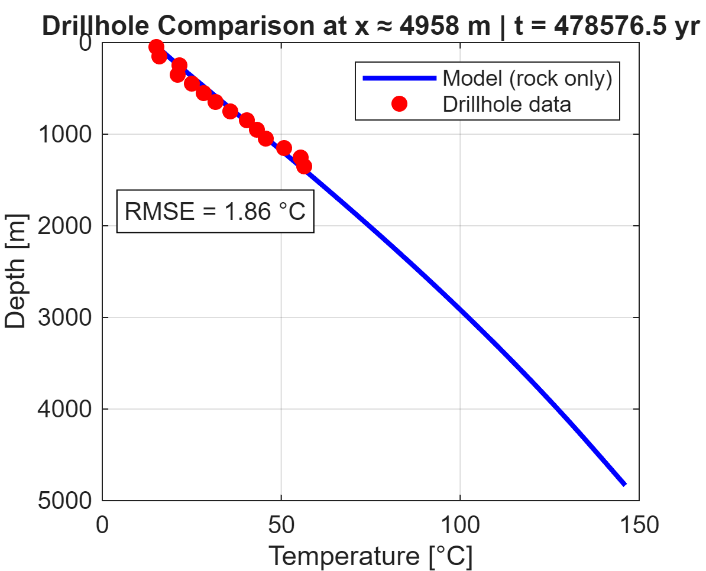
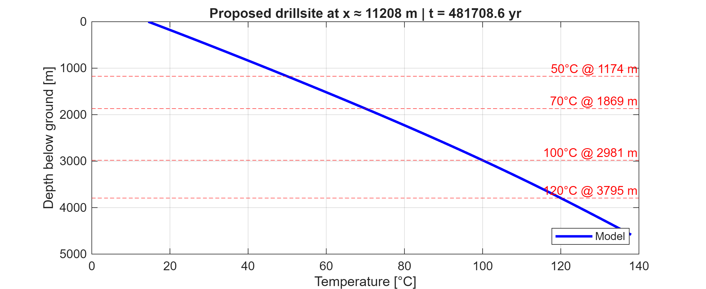
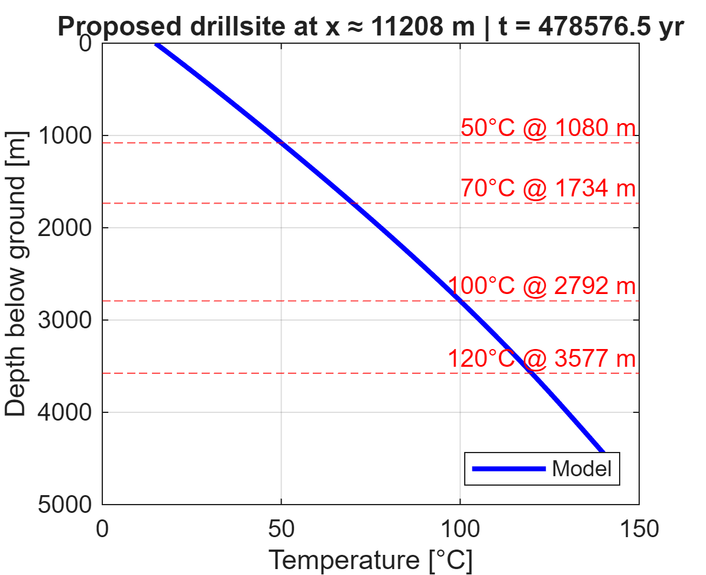
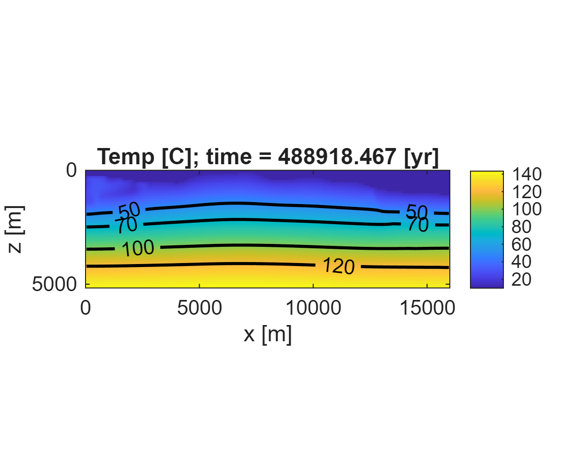
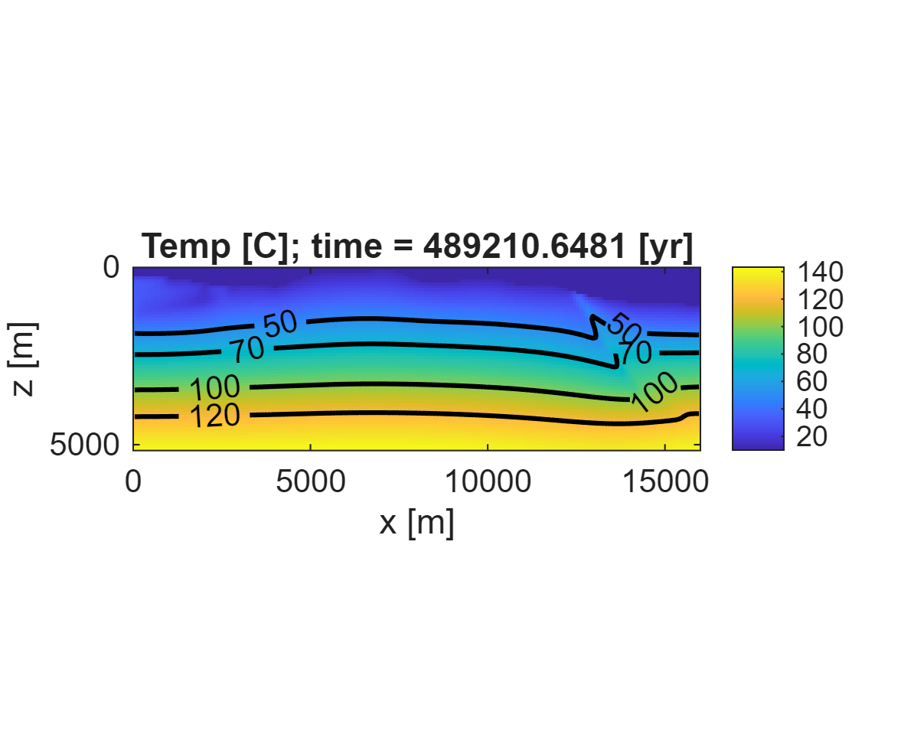

# Helmsdale groundwater flow and geothermal model

A collaborative MSc Computational Geoscience project at the University of Glasgow, using MATLAB to investigate geothermal potential near Helmsdale in the Scottish Highlands.

## Overview

This 2D numerical model combines groundwater circulation with heat transport through a geological cross section containing granite, sediments and a normal fault.

The project investigates how granite heat production and fault flow properties affect underground temperatures and potential geothermal drilling locations.

## Model setup

### Geological cross section

Geological vertical cross section showing the Helmsdale granite phases, surrounding geological units and fault zone represented in the model.

### Reference model starting conditions

Initial temperature distribution, Darcy mobility, radiogenic heat production and thermal conductivity.

## Methods demonstrated

* Groundwater flow modelling using Darcy’s law.

* Coupled heat advection and diffusion.

* Assigning geological properties and boundary conditions.

* Parameter sensitivity analysis.

* Comparing modelled temperatures with borehole observations using RMSE.

* Numerical verification against an analytical solution and convergence tests.

## Example results

### 1. Comparing predictions with borehole observations

Modelled temperature profiles were compared with supplied borehole observations. Higher granite heat production improved the fit in the scenarios tested: RMSE was 3.47°C for lower heat production, 2.18°C for the reference model and 1.86°C for higher heat production.

| Lower radiogenic heat production | Higher radiogenic heat production |
| :---: | :---: |
|  |  |

Blue curves show modelled temperatures after approximately 480,000 years, while red points show borehole observations.

### 2. Implications for the proposed drilling site

At the proposed site, higher radiogenic heat production brought target temperatures to shallower depths. The predicted depth to 100°C decreased from 2,981 m in the lower heat production scenario 
to 2,792 m in the higher scenario.

| Lower radiogenic heat production | Higher radiogenic heat production |
| :---: | :---: |
|  |  |

These are predicted temperature depth profiles at the proposed site, rather than measured borehole temperatures.

### 3. Sensitivity to Darcy mobility

Changing the fault Darcy mobility altered groundwater circulation and temperature distribution. In the scenarios tested, higher mobility increased downward transport of cooler water and slightly increased the predicted depth to 100°C at the proposed site.

| Lower Darcy mobility | Higher Darcy mobility |
| :---: | :---: |
|  |  |

The predicted depth to 100°C increased from 2,856 m to 2,921 m between the lower and higher mobility scenarios.

## Running the code

Requires MATLAB with Image Processing Toolbox.

Set MATLAB’s Current Folder to usr and run Thermal_ref.m. Figures are saved to out/thermal_ref/.

Other Thermal scripts explore sensitivity scenarios. Run run_convtest_dt.m and run_convtest_dx.m for convergence tests.
